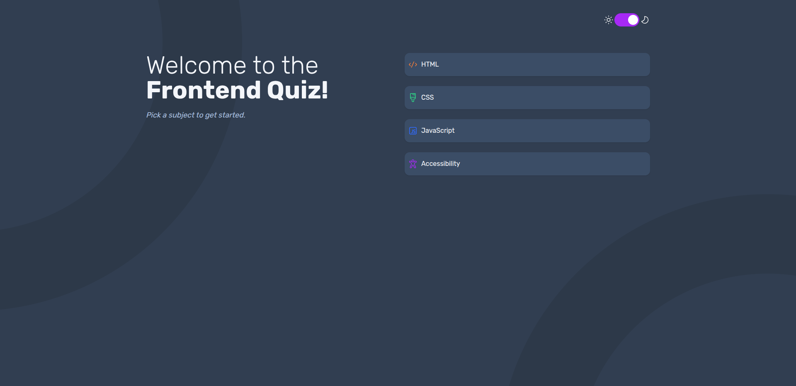
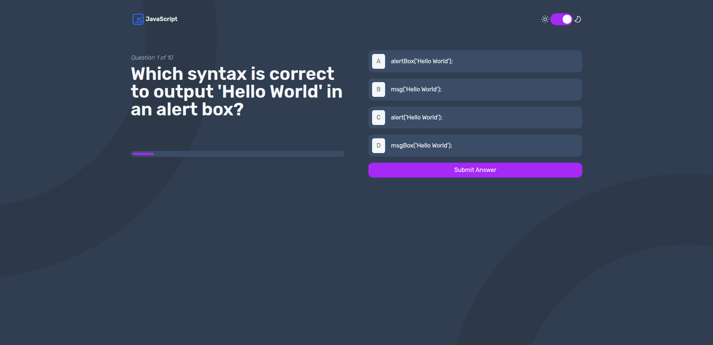
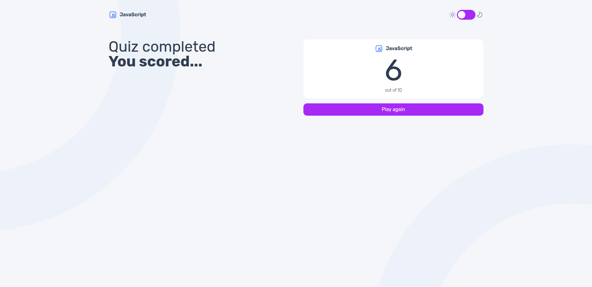
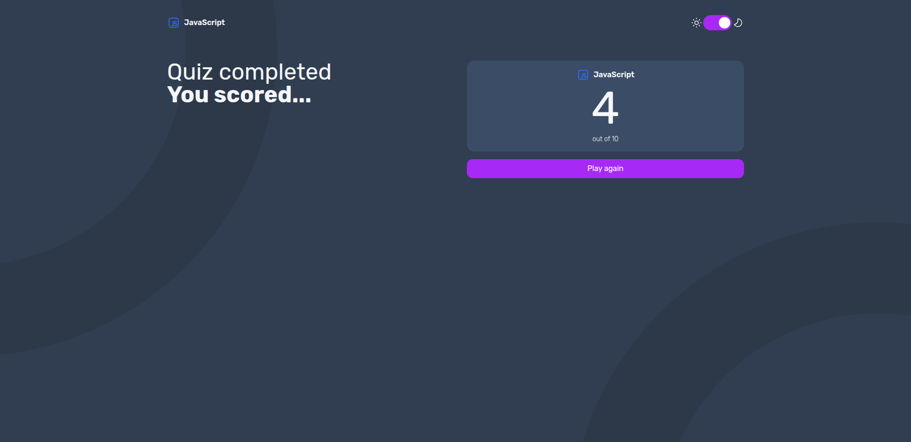

# Frontend Mentor - Frontend quiz app solution

This is a solution to the [Frontend quiz app challenge on Frontend Mentor](https://www.frontendmentor.io/challenges/frontend-quiz-app-BE7xkzXQnU). Frontend Mentor challenges help you improve your coding skills by building realistic projects.

## Table of contents

- [Overview](#overview)
  - [The challenge](#the-challenge)
  - [Screenshot](#screenshot)
  - [Links](#links)
- [My process](#my-process)
  - [Built with](#built-with)
  - [What I learned](#what-i-learned)
  - [Continued development](#continued-development)
  - [Useful resources](#useful-resources)
- [Installation](#installation)
- [Author](#author)

## Overview

### The challenge

Users should be able to:

- Select a quiz subject
- Select a single answer from each question from a choice of four
- See an error message when trying to submit an answer without making a selection
- See if they have made a correct or incorrect choice when they submit an answer
- Move on to the next question after seeing the question result
- See a completed state with the score after the final question
- Play again to choose another subject
- View the optimal layout for the interface depending on their device's screen size
- See hover and focus states for all interactive elements on the page
- **Bonus**: Change the app's theme between light and dark

### Screenshot








### Links

- Solution URL: [Visit](https://github.com/ZTanvir/fem-quiz-app)
- Live Site URL: [Add live site URL here](https://your-live-site-url.com)

## My process

### Built with

- Typescript
- Tailwind Css
- Flexbox
- CSS Grid
- Mobile-first workflow
- Localstorage
- [React](https://reactjs.org/) - JS library
- [Swr](https://swr.vercel.app/) - Data fetch library

### What I learned

#### Advanced State Management with useReducer

Managing complex UI transitions can quickly lead to "state spaghetti" with multiple useState hooks. For the quiz logic, I implemented `useReducer` to centralize the state logic into a clean, predictable state machine.

The application flows through three distinct statuses:

- **idle:** The default state. Prevents users from progressing without selecting an answer via custom error handling.
- **CheckQuiz:** Triggers the validation logic to compare user selections against the correct answers.
- **Score:** Handles the transition to the results view and calculates the final tally.

**Why this matters**: Using the dispatch pattern ensured that state transitions were explicit and bug-resistant. It turned what could have been a messy series of if/else statements into a scalable architecture.

```JSX
  const [quizState, quizDispatch] = useReducer(quizReducer,quizInitialState);
```

```
  quizDispatch({ type: "idle" });
```

#### Helper Functions over Inline Conditionals

One of the challenges in this project was dynamically styling components based on the quiz state (e.g., highlighting correct vs. incorrect answers). Initially, this logic was cluttering the JSX, making the component difficult to read.

I refactored this by extracting the style logic into pure helper functions.

Before refactored:

```// Hard to read inline logic
  <span className={`text-sm ${state === 'idle' ? 'text-gray' : isCorrect ? 'text-white' : 'text-gray'}`}>
```

After refactored:

```JSX
 const getOptionSerialTextColorClass = (option: string) => {
    if (quizState === "idle") {
      return "text-brand-gray-navy";
    }

    // for checkQuiz and score state
    if (isAnswerValid && selectedAnswer === option) {
      //  valid answer
      return "text-brand-snow-white";
    } else if (!isAnswerValid && selectedAnswer === option) {
      // invalid answer
      return "text-brand-snow-white";
    }
    return "text-brand-gray-navy";
  };
```

### Continued development

A backend can be added to generate both user specific quiz and track user specific result.

### Useful resources

- [React doc](https://react.dev/) - This helped me to understand react hook better and their use case.

## Getting Started

To get a local copy of this project up and running, follow these steps.

### Prerequisites

- **Node.js** (v18.x or higher) and **npm** or **yarn**.
- **Npm**: If you prefer using npm for package management and running scripts.

## Installation

1. **Clone the repository:**

   ```bash
   git clone https://github.com/ZTanvir/fem-quiz-app.git
   cd fem-quiz-app
   ```

2. **Install dependencies:**

   Using Npm:

   ```bash
   npm install
   ```

3. **Start the development server:**

   ```bash
   npm run dev
   ```

   Open [http://localhost:5173/](http://localhost:5173/) to view the app in your browser.

4. **Start the json server:**

   ```bash
   npm run json-server
   ```

   Open [http://localhost:3000/quizzes](http://localhost:3000/quizzes) to view the quiz data in your browser.

## Author

- Github - [@Ztanvir](https://github.com/ZTanvir)
- Frontend Mentor - [@ZahirulIslamTanvir](https://www.frontendmentor.io/profile/ZahirulIslamTanvir)
